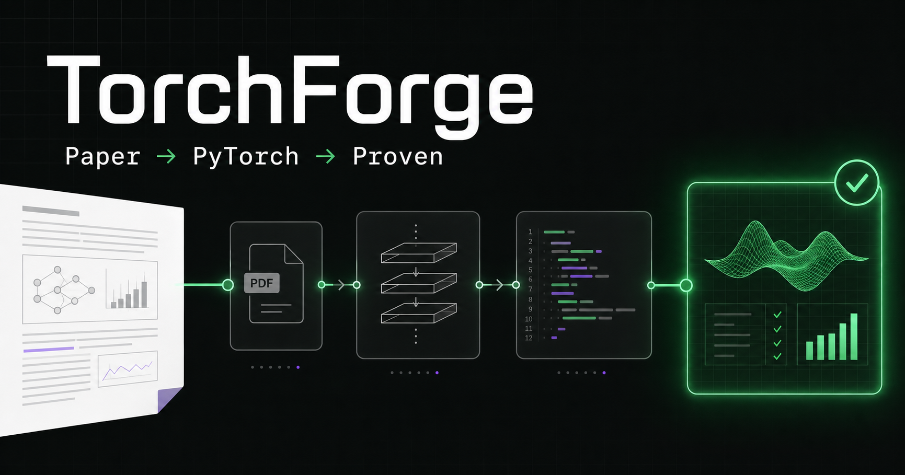
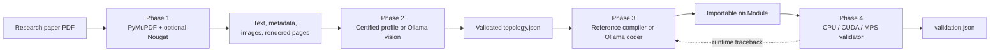

# TorchForge

[](https://github.com/levithion/TorchForge/actions/workflows/ci.yml)
[](https://www.python.org/)
[](https://pytorch.org/)
[](https://ollama.com/)

**Turn transformer and NLP research papers into structured, executable, and
validated PyTorch modules.**

TorchForge is a local-first research engineering pipeline. It extracts text and
figures from a PDF, converts architecture evidence into a strict topology,
generates an importable `torch.nn.Module`, and executes architecture-aware
validation on CPU, NVIDIA CUDA, or Apple MPS.

TorchForge Studio provides a browser workspace for the same pipeline: upload a
paper, run each phase, monitor local model availability, and inspect the text,
topology, generated code, manifest, and validation report.



> [!IMPORTANT]
> TorchForge generates and executes Python code. Its AST checks reject several
> dangerous or invalid patterns, but they are not a security sandbox. Use trusted
> papers and local models, review generated source, and run untrusted experiments
> inside an isolated account, container, or virtual machine.

## Table of contents

- [What TorchForge does](#what-torchforge-does)
- [Pipeline architecture](#pipeline-architecture)
- [Current support level](#current-support-level)
- [Requirements](#requirements)
- [Quick start](#quick-start)
- [Using TorchForge Studio](#using-torchforge-studio)
- [Using the CLI](#using-the-cli)
- [Phase details](#phase-details)
- [Artifacts and manifest](#artifacts-and-manifest)
- [Validation model](#validation-model)
- [Configuration](#configuration)
- [HTTP API](#http-api)
- [Testing](#testing)
- [Repository layout](#repository-layout)
- [Troubleshooting](#troubleshooting)
- [Limitations](#limitations)
- [Contributing](#contributing)
- [License](#license)

## What TorchForge does

TorchForge is designed around a simple question:

> Can a paper be converted into a model implementation whose assumptions,
> structure, code, and runtime evidence remain inspectable?

It answers that question with four explicit phases:

1. **Extract** — deterministically recover text, metadata, embedded images, and
   high-resolution candidate figure pages.
2. **Parse** — convert paper evidence into a validated architecture graph with
   named inputs, layers, parameters, connections, outputs, assumptions, and
   confidence.
3. **Compile** — create one device-agnostic PyTorch module and reject invalid or
   suspicious source before it is imported.
4. **Validate** — instantiate the module, run representative tensors, check
   outputs and gradients, and repair runtime failures when permitted.

Each phase writes durable artifacts. Later phases consume the manifest rather
than guessing filenames or relying on hidden application state.

## Pipeline architecture



The browser workspace and CLI call the same Python services:

```text
TorchForge Studio ─┐
                   ├─> FastAPI / CLI ─> extraction ─> topology ─> compiler ─> validator
torchforge CLI ────┘
```

## Current support level

| Architecture | Topology | Code generation | Validation guarantee |
|---|---|---|---|
| **BERT Base encoder** | Certified profile | Deterministic reference implementation | Structural, semantic, gradient, device, parameter-count, and Hugging Face parity checks |
| Other transformer/NLP papers | Ollama vision interpretation | Ollama code generation | Schema, confidence, static-source, and portable runtime checks |

### Certified BERT Base behavior

When the original BERT paper is identified unambiguously, TorchForge creates a
complete BERT Base topology instead of trusting a small vision model to
reconstruct well-known details. The profile includes:

- token, position, and token-type embeddings;
- hidden size `768`;
- `12` encoder layers;
- `12` self-attention heads;
- intermediate size `3072`;
- GELU activation;
- post-normalization residual blocks;
- attention masks and segment IDs;
- the final hidden state and tanh pooler output;
- `109,482,240` parameters for the encoder with pooler; and
- a `load_huggingface_state_dict()` adapter.

The optional reference suite maps the same weights into Hugging Face
`BertModel` and TorchForge BERT, then compares masked and segmented forward
outputs numerically.

### Unknown architecture safety gate

Unknown architectures remain model interpretations. TorchForge:

- validates topology structure with Pydantic;
- limits pathological layer and connection expansion;
- recalibrates confidence when graph details are missing;
- requires an overall topology confidence of at least `0.60`; and
- blocks Phase 3 when the topology is incomplete or low-confidence.

This prevents a plausible-looking Python file from being treated as success when
Phase 2 did not produce an implementation-ready graph.

## Requirements

### Required

| Component | Version or guidance | Used for |
|---|---|---|
| Python | `>=3.11,<3.13` | Pipeline, API, extraction, validation |
| [`uv`](https://docs.astral.sh/uv/) | Current stable release | Python and lockfile management |
| Node.js | `>=22.13.0` | TorchForge Studio |
| npm | Bundled with Node.js | Frontend installation and build |
| Ollama | Current release | Unknown-paper vision parsing and code generation |

### Default local models

```bash
ollama pull llava
ollama pull qwen2.5-coder:3b
```

- `llava` is the default vision model.
- `qwen2.5-coder:3b` is the default coding model.
- Certified profiles such as BERT Base do not require Ollama for their
  deterministic Phase 2 and Phase 3 paths.

### Hardware

- A GPU is optional.
- Runtime validation chooses CUDA first, then Apple MPS, then CPU.
- CPU-only execution works but local vision and code generation may be slow.
- Model memory requirements depend on the selected Ollama model and context
  window.

### Optional Nougat OCR

Nougat is intentionally excluded from the base dependency set because its model
and ML dependencies are large. When a `nougat` executable is available,
TorchForge invokes:

```bash
nougat paper.pdf -o output_directory
```

If Nougat is missing, fails, or times out, valid PyMuPDF extraction is preserved
and the manifest records a warning.

## Quick start

### 1. Clone the repository

```bash
git clone https://github.com/levithion/TorchForge.git
cd TorchForge
```

### 2. Install the Python environment

```bash
uv python install 3.11
uv sync --extra dev
```

For the independent BERT reference tests:

```bash
uv sync --extra dev --extra reference
```

### 3. Prepare Ollama

Start Ollama according to your operating system, then install the defaults:

```bash
ollama pull llava
ollama pull qwen2.5-coder:3b
```

Verify that Ollama is reachable:

```bash
curl http://127.0.0.1:11434/api/tags
```

### 4. Extract a paper

```bash
uv run torchforge extract path/to/paper.pdf --no-nougat
```

The command prints a JSON result containing the collision-safe artifact
directory. Use that directory in later commands:

```bash
uv run torchforge parse temp_assets/<paper-name-and-hash>
uv run torchforge compile temp_assets/<paper-name-and-hash>
uv run torchforge validate temp_assets/<paper-name-and-hash>
```

## Using TorchForge Studio

TorchForge Studio is a frontend for the local engine. The frontend does not run
PyTorch or Ollama in the browser.

### Start the backend

From the repository root:

```bash
uv run torchforge serve
```

The API listens on `http://127.0.0.1:8000`.

### Start the frontend

In a second terminal:

```bash
cd frontend
npm ci
npm run dev
```

Open [http://localhost:3000](http://localhost:3000).

The workspace supports:

- drag-and-drop PDF upload;
- extraction, parsing, compilation, and validation actions;
- local Ollama and device health;
- paper history;
- stage progress and repair status;
- artifact inspection; and
- architecture-profile and output-shape summaries.

### Use a different backend URL

Copy the example environment file:

```bash
cd frontend
cp .env.example .env.local
```

Then edit:

```dotenv
NEXT_PUBLIC_TORCHFORGE_API_URL=http://127.0.0.1:8000
```

When the frontend uses another origin, add it to
`TORCHFORGE_ALLOWED_ORIGINS` on the backend.

## Using the CLI

```text
torchforge [--verbose] {extract,watch,parse,compile,validate,serve}
```

### Extract one PDF

```bash
uv run torchforge extract path/to/paper.pdf
```

Skip Nougat discovery:

```bash
uv run torchforge extract path/to/paper.pdf --no-nougat
```

Choose another artifact root:

```bash
uv run torchforge extract path/to/paper.pdf \
  --assets-root /path/to/assets
```

### Watch a directory

```bash
uv run torchforge watch
```

The watcher:

- monitors `input_papers/` by default;
- ignores non-PDF files;
- waits for copied files to stop changing;
- deduplicates repeated events by content hash; and
- logs invalid PDFs without stopping.

Example with explicit paths:

```bash
uv run torchforge watch \
  --input-dir input_papers \
  --assets-root temp_assets \
  --stability-timeout 60 \
  --no-nougat
```

Press `Ctrl-C` to stop cleanly.

### Parse architecture diagrams

```bash
uv run torchforge parse temp_assets/<paper-name-and-hash>
```

Use another vision model:

```bash
uv run torchforge parse temp_assets/<paper-name-and-hash> \
  --model gemma3 \
  --ollama-url http://127.0.0.1:11434 \
  --context-window 8192 \
  --max-images 8
```

### Generate a PyTorch module

```bash
uv run torchforge compile temp_assets/<paper-name-and-hash>
```

Tune bounded generation:

```bash
uv run torchforge compile temp_assets/<paper-name-and-hash> \
  --model qwen2.5-coder:3b \
  --max-text-chars 6000 \
  --context-window 8192 \
  --max-output-tokens 4096
```

### Validate and repair

```bash
uv run torchforge validate temp_assets/<paper-name-and-hash>
```

Choose a device explicitly:

```bash
uv run torchforge validate temp_assets/<paper-name-and-hash> --device cpu
uv run torchforge validate temp_assets/<paper-name-and-hash> --device mps
uv run torchforge validate temp_assets/<paper-name-and-hash> --device cuda
```

Disable automatic repair:

```bash
uv run torchforge validate temp_assets/<paper-name-and-hash> --max-repairs 0
```

### Run the API on another address

```bash
uv run torchforge serve --host 127.0.0.1 --port 8000
```

`python main.py` accepts the same subcommands after `uv sync`.

## Phase details

### Phase 1 — deterministic extraction

Implementation: [`src/torchforge/extractor.py`](src/torchforge/extractor.py)

- validates file existence, extension, PDF content, encryption, and page count;
- calculates the full source SHA-256;
- stores artifacts under `<safe-name>-<hash-prefix>`;
- extracts page text and PDF metadata with PyMuPDF;
- saves embedded images in their original encoded format;
- renders likely figure pages at 150 DPI;
- preserves vector diagrams through page rendering;
- optionally retains Nougat `.mmd` output; and
- cleans stale managed artifacts when the same PDF is reprocessed.

Successful fallback extraction reports `completed_with_warnings`; corrupt,
encrypted, empty, or unreadable PDFs report `failed`.

### Phase 2 — topology parsing

Implementation:
[`src/torchforge/vision_parser.py`](src/torchforge/vision_parser.py) and
[`src/torchforge/topology.py`](src/torchforge/topology.py)

- selects rendered pages with actual figure captions when possible;
- sends at most eight candidate images by default;
- combines paper identity, text evidence, and diagrams;
- requires structured output matching `NetworkTopology`;
- validates IDs, graph endpoints, shapes, parameters, assumptions, and bounds;
- uses certified profiles when paper identity is unambiguous;
- caps confidence for incomplete unknown graphs; and
- marks the manifest topology as usable only when confidence is at least `0.60`.

### Phase 3 — guarded compilation

Implementation: [`src/torchforge/compiler.py`](src/torchforge/compiler.py)

- consumes `topology.json` and extracted paper text;
- refuses low-confidence or invalid Phase 2 topologies;
- uses deterministic source for certified profiles;
- uses Ollama structured generation for other architectures;
- requires exactly one root `nn.Module`;
- strips Markdown fences and executable `__main__` examples;
- rejects syntax errors and top-level execution;
- rejects hard-coded CUDA behavior;
- checks `super().__init__()`, `forward`, and initialized module attributes; and
- records the source SHA-256, model, class, and assumptions.

Generated files are written to `output_code/`.

### Phase 4 — runtime and conformance validation

Implementation: [`src/torchforge/validator.py`](src/torchforge/validator.py)

- safely resolves the generated class from the manifest;
- infers common constructor arguments from topology parameters;
- creates representative integer, mask, or floating-point tensors;
- selects CUDA, MPS, or CPU;
- executes `forward`;
- verifies tensor outputs and finite values;
- checks backward gradient flow for certified profiles;
- records input and output shapes;
- captures complete tracebacks; and
- can send bounded runtime feedback to Phase 3 for repair.

For BERT Base, Phase 4 additionally checks:

- forward arguments;
- all three embedding types;
- embedding normalization and dropout;
- LayerNorm epsilon;
- encoder depth;
- hidden size and attention heads;
- feed-forward width and GELU;
- dropout configuration;
- batch-first semantics;
- pooler structure;
- exact parameter count;
- Hugging Face checkpoint adapter;
- output contracts;
- finite outputs;
- gradient flow; and
- batch independence.

## Artifacts and manifest

### Artifact directory

```text
temp_assets/attention-is-all-you-need-a1b2c3d4e5f6/
├── manifest.json
├── pymupdf.md
├── nougat.mmd              # only when Nougat succeeds
├── topology.json           # after Phase 2
├── validation.json         # after Phase 4
├── images/
│   └── page-003-img-01-xref-42.jpeg
└── pages/
    └── page-003.png
```

Generated Python source is written separately:

```text
output_code/
└── attention_is_all_you_need_a1b2c3d4e5f6.py
```

### Manifest lifecycle

`manifest.json` is the contract between phases. It records:

- source path and SHA-256;
- extraction status and page count;
- PDF metadata;
- OCR provider;
- artifact paths;
- warnings and errors;
- selected topology source images;
- topology model, confidence, and usability;
- generated class, compiler, assumptions, and source digest; and
- validation device, status, attempts, and output shapes.

Primary statuses:

| Status | Meaning |
|---|---|
| `completed` | Stage succeeded without repair or fallback warnings |
| `completed_with_warnings` | Extraction succeeded using a fallback |
| `repaired` | Initial generated code failed but a later repair passed |
| `failed` | The stage could not produce a usable result |

## Validation model

TorchForge deliberately separates different meanings of “works”:

| Level | Evidence |
|---|---|
| Schema-valid | Topology or response satisfies the strict data model |
| Statically valid | Source parses and meets the minimum `nn.Module` contract |
| Runtime-valid | Representative tensors execute and return tensor outputs |
| Structurally conformant | A certified profile matches required components and dimensions |
| Reference-verified | Identical imported weights produce matching reference outputs |

Passing a forward shape test alone does **not** prove paper fidelity. Strict
structural and reference claims are made only for certified profiles.

## Configuration

### Environment variables

| Variable | Default | Purpose |
|---|---|---|
| `TORCHFORGE_ROOT` | Current working directory | Backend project and artifact root |
| `TORCHFORGE_ALLOWED_ORIGINS` | Local frontend plus deployed Studio origin | Comma-separated API CORS origins |
| `NEXT_PUBLIC_TORCHFORGE_API_URL` | `http://127.0.0.1:8000` | Frontend API base URL |

### Important CLI defaults

| Option | Default |
|---|---|
| Assets directory | `temp_assets/` |
| Watched input directory | `input_papers/` |
| Generated-code directory | `output_code/` |
| Vision model | `llava` |
| Coding model | `qwen2.5-coder:3b` |
| Ollama URL | `http://127.0.0.1:11434` |
| Vision timeout | `300` seconds |
| Compiler timeout | `600` seconds |
| Nougat timeout | `1200` seconds |
| Context window | `8192` tokens |
| Maximum code output | `4096` tokens |
| Maximum supplied paper text | `6000` characters |
| Maximum candidate images | `8` |
| Maximum repairs | `2` |

Run any command with `--help` for its complete interface:

```bash
uv run torchforge validate --help
```

## HTTP API

The local FastAPI service exposes the frontend workflow.

| Method | Route | Purpose |
|---|---|---|
| `GET` | `/api/health` | Device, Ollama, and default-model health |
| `GET` | `/api/papers` | List available paper artifacts |
| `GET` | `/api/papers/{paper_id}` | Read one paper summary |
| `POST` | `/api/papers` | Upload and extract a PDF |
| `POST` | `/api/papers/{paper_id}/parse` | Run Phase 2 |
| `POST` | `/api/papers/{paper_id}/compile` | Run Phase 3 |
| `POST` | `/api/papers/{paper_id}/validate` | Run Phase 4 |
| `GET` | `/api/papers/{paper_id}/artifacts/{name}` | Read an allowed artifact |

Uploads are limited to 100 MiB. Filenames and artifact paths are normalized and
checked to remain within configured project directories.

## Testing

### Complete Python and reference suite

```bash
uv sync --extra dev --extra reference
uv run --extra reference pytest -q
```

### BERT parity only

```bash
uv run --extra reference pytest tests/test_bert_reference.py -q
```

### Frontend build and tests

```bash
cd frontend
npm ci
npm test
```

The current suite covers:

- text, metadata, image, and candidate-page extraction;
- content-hash collision isolation;
- stale artifact cleanup;
- Nougat success and fallback paths;
- watcher stability and deduplication;
- topology schema and confidence gates;
- certified BERT topology normalization;
- Ollama request and error handling;
- compiler AST validation;
- low-confidence compilation blocking;
- CPU/MPS/CUDA selection behavior;
- forward outputs, gradient flow, repairs, and reports;
- Hugging Face BERT numerical parity;
- API behavior; and
- frontend server rendering and real pipeline interactions.

GitHub Actions runs the Python/reference and frontend jobs on every push to
`main` and on every pull request.

## Repository layout

```text
TorchForge/
├── .github/workflows/ci.yml
├── frontend/                   # TorchForge Studio
│   ├── app/
│   ├── public/
│   ├── tests/
│   └── package.json
├── input_papers/               # watched PDFs; contents ignored by Git
├── output_code/                # generated modules; contents ignored by Git
├── src/torchforge/
│   ├── api.py
│   ├── architecture_profiles.py
│   ├── cli.py
│   ├── compiler.py
│   ├── extractor.py
│   ├── models.py
│   ├── nougat.py
│   ├── topology.py
│   ├── validator.py
│   ├── vision_parser.py
│   └── watcher.py
├── temp_assets/                # manifests and artifacts; contents ignored
├── tests/
├── main.py
├── pyproject.toml
└── uv.lock
```

## Troubleshooting

### Ollama connection refused

Confirm that Ollama is running:

```bash
curl http://127.0.0.1:11434/api/tags
```

Then verify the required models:

```bash
ollama list
```

Use `--ollama-url` if Ollama is listening elsewhere.

### Request exceeds the model context size

TorchForge defaults to an `8192`-token context and bounded input/output sizes.
For a smaller model, reduce one or more limits:

```bash
uv run torchforge compile temp_assets/<artifact> \
  --max-text-chars 4000 \
  --context-window 4096 \
  --max-output-tokens 2048
```

Larger generated architectures may require a model with a larger supported
context window.

### Phase 2 is marked unusable

Inspect `topology.json` and the manifest’s `vision.overall_confidence`.
TorchForge blocks Phase 3 below `0.60`. Try:

- increasing `--max-images`;
- selecting a stronger vision model;
- confirming that architecture diagrams were rendered;
- checking that the PDF contains real figure captions; or
- correcting the topology before compilation.

### Validation is slow

Validation may instantiate a large model and run a backward pass. Check the
selected device in `validation.json`. Use:

```bash
uv run torchforge validate temp_assets/<artifact> --device cpu
```

CPU is the most portable option, but not always the fastest.

### Nougat is missing

Either install a compatible `nougat` executable or skip its discovery:

```bash
uv run torchforge extract paper.pdf --no-nougat
```

PyMuPDF extraction remains available.

### Frontend cannot reach the backend

Check both services:

```bash
curl http://127.0.0.1:8000/api/health
curl http://127.0.0.1:11434/api/tags
```

Confirm `NEXT_PUBLIC_TORCHFORGE_API_URL` and
`TORCHFORGE_ALLOWED_ORIGINS` when using different hosts.

## Limitations

- TorchForge targets transformer and NLP papers, not arbitrary neural
  architectures.
- BERT Base is currently the only independently certified architecture profile.
- Other architectures remain vision- and code-model interpretations.
- Generated weights are random unless a compatible checkpoint is loaded.
- Tokenizers, datasets, pretraining, and downstream fine-tuning are outside the
  current pipeline.
- Runtime success does not prove convergence, task quality, or paper-level
  numerical equivalence.
- Password-protected PDFs are rejected.
- Unusual figure-caption styles can be missed.
- Watcher deduplication is in-memory and resets with the process.
- Nougat can be slow and may download model weights on first use.
- Automatic repair remains model-generated code and requires review.
- The runtime validator is not an operating-system security sandbox.

## Contributing

Contributions are welcome through focused pull requests.

1. Fork and clone the repository.
2. Create a branch from `main`.
3. Keep generated PDFs, artifacts, model outputs, and environments out of Git.
4. Add or update tests for behavioral changes.
5. Run:

   ```bash
   uv run --extra reference pytest -q
   cd frontend && npm test
   ```

6. Explain user impact, assumptions, and validation evidence in the pull request.

Useful contribution areas include:

- additional certified architecture profiles;
- independent checkpoint/output parity suites;
- better text-grounded topology extraction;
- stronger generated-code isolation;
- additional task heads and checkpoint formats;
- persistent watcher deduplication; and
- Windows and Linux integration coverage.

## License

No open-source license has been selected yet. Until a license is added, the
repository remains **all rights reserved** and reuse is not automatically
granted.
